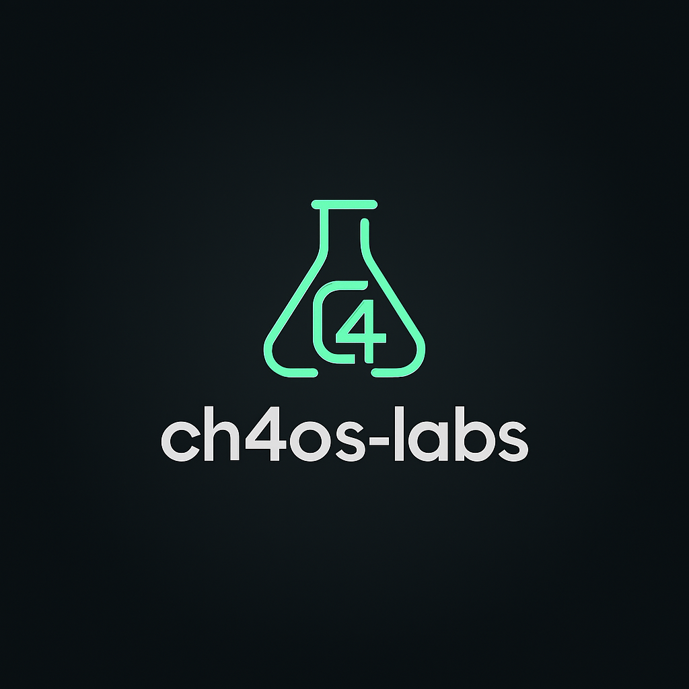

# ch4os-labs

> Engineering clarity from complexity.  
> Building resilient systems, ethical AI, and high-velocity teams.

## About Me

I'm **Tab Ours**, I am an expierenced Engineer focused on:
- Responsible AI & agentic systems
- Secure software architecture & operational resilience
- High-velocity engineering cultures
- Creative storytelling through code, systems, and design

## Featured Projects

- [`ch4os-agents`](https://github.com/ch4os-labs/ch4os-agents) — Agentic AI orchestration
- [`ch4os-hielo`](https://github.com/ch4os-labs/ch4os-hielo) — Minimalist CSS framework
- [`labs`](https://github.com/ch4os-labs?tab=repositories) — Prototypes and chaos-taming tools

## Connect

[LinkedIn](https://linkedin.com/in/tabours) • [Medium](https://medium.com/@tabours) • [GitHub Pages](https://ch4os-labs.github.io)

---

© Tab Ours · MIT License
